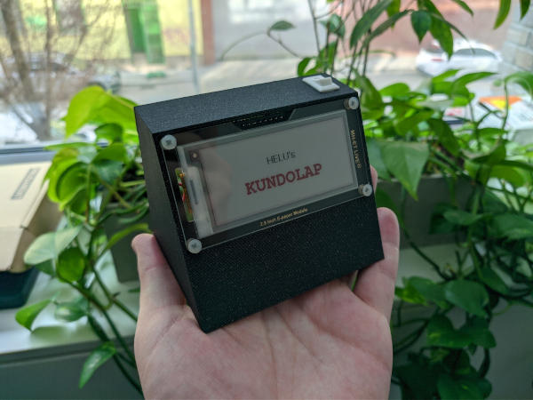

# Kundolap Workshop

Everyone was in the situation when he need to attract some female of the species. For this purpose, you can build your own **Kundolap**. It is light and small, so you can take it anywhere with you. Just press the button and wait.

  

The program connects to Wi-Fi, loads JSON data from Google Spreadsheets API, parses the JSON, and displays the data on the screen. ESP8266 board periodically goes to deep sleep to save the battery.

## Hardware Components
- **1x** NodeMCU V3(CH340G) board with ESP8266 Microchip - **2.39$**
- **1x** MH-ET LIVE 2.9' E-Paper Module(Red) - **19.26$**
- **1x** TP4056 USB-C Lithium Battery Charger Module - **0.44$**
- **1x** LiitoKala 18650 HG2 3000 mAh Li-Ion Battery - **6.35$**
- **1x** Push Button Switch 10 x 15 mm - **0.15$**
- Some cables, soldering wire. **0.1$**
- Plastic box printed on Prusa 3D printer

**Total price: 28.69$**

Some components can be much cheaper when bought in bulk.

## Hardware Connections
- Connection of TP4056 module, NodeMCU board, button switch, battery:
  - TP4056.OUT+ -> Button 0
  - TP4056.B+ -> Battery +
  - TP4056.B- -> Battery -
  - TP4056.OUT- -> NodeMCU.G
  - NodeMCU.VIN -> Button 1

- Connection of E-Paper module with NodeMCU board:
  - BUSY -> D2
  - RST -> D4
  - DC -> D3
  - CS -> D8
  - SCLK -> D5
  - SDI -> D7
  - GND -> GND
  - VCC -> 3V

- NodeMCU board connections:
  - D0 -> RST for the deep sleep (disconnect when programming)
  - 3K3 pull-down resistor between D8 and GND

## IDE Setup
- Install **CH340** driver
- Install **Arduino IDE**
- Install **ESP8266** add-on in Arduino IDE
  - File -> Preferences
  - Add additional boards manager URL: http://arduino.esp8266.com/stable/package_esp8266com_index.json
  - Tools -> Board -> Boards Manager
  - Search for **ESP8266** and press install button for the “ESP8266 by ESP8266 Community“
  - Select the board in Tools -> Boards -> ESP8266 Boards -> **NodeMCU 1.0 (ESP-12E Module)** (You may need to restart the IDE first)
- Install libraries in Arduino IDE
  - Tools -> Manage Libraries
  - Search and install **GxEPD2**, **ArduinoJson** and **Adafruit BusIO**
- Tools -> Upload Speed -> 921600
- You will need to select correct USB port (Tools -> Port)

### Advanced IDE Setup
1. Download VSCode if you don't have it already
2. Install "Arduino" Plugin (Arduino for Visual Studio Code) - In extensions tab on the left - box icon, Shift+Cmd+X
3. Open project folder
4. When popup with C++ support appear, feel free to install it
5. When popup "Configure your IntelliSense settings to help find missing headers" appears, you can hit skip, or close it.
6. Enter View -> Command Pallete(Ctrl + Shift + P or Cmd + Shift + P) and run `Arduino: Initialize`
7. You will be asked to select board type. You should select following one: `NodeMCU 1.0(ESP-12E Module)`
8. Delete file in `.vscode/c_cpp_properties.json` and restart VSCode.
9. Wait and hope that all files will be correctly initialized and all warning disappear.

Note: In any case, you can try to also follow any tutorial like this one: https://maker.pro/arduino/tutorial/how-to-use-visual-studio-code-for-arduino

## Power Consumption
The power consumption of the whole device is still not ideal. The main problem is that there are two voltage converters used. We should focus on this more in the future. Right now we have one step-up convertor to make 5V from the battery. NodeMCU then takes this 5V and uses a step-down convertor to make 3.3V out of it. This leads to much bigger power consumption than needed.

So far I measured the following power consumption:
- 3.8 mA when the device is in Deep Sleep. ESP8266 should have around 20µA in the deep sleep. You can nicely see the voltage regulator problem here.
- 70 mA when under heavy load with WiFi on.
- 25 mA when the display is refreshing.

## Developed by
[Lukas Hermann](https://helu.cz/)
[Petr Nohejl](https://petrnohejl.cz)